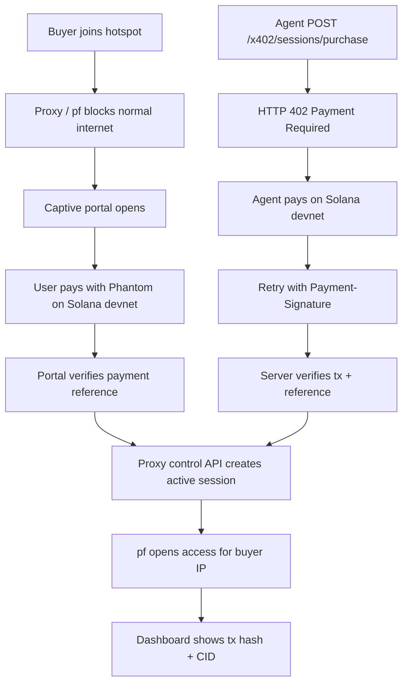

# Architecture

## System Components

- `captive-portal/`
  - DNS interception for captive-network probes
  - pf firewall integration
  - mobile Solana Pay checkout
  - opens/closes firewall access per buyer IP

- `proxy-server/`
  - traffic gate on port `8080`
  - control plane on port `3001`
  - session ledger shared by human and agent flows
  - Solana transaction verification
  - x402 purchase and extension endpoints
  - CID artifact creation and optional Synapse upload

- `frontend/`
  - marketplace for buyers/judges
  - host listing flow
  - dashboard for sessions, proofs, and reliability

- `contracts/`
  - legacy escrow prototype, not part of the main demo path

## Request / Payment / Session Flow

## Where Solana Fits

- Human flow:
  - the captive portal builds a Solana Pay request
  - the portal polls Solana devnet for the payment reference
  - on confirmation, the hotspot unlocks

- Agent flow:
  - `/x402/sessions/purchase` and `/x402/sessions/:sessionId/extend` are payment-gated
  - the server returns `402 Payment Required`
  - the server verifies the submitted Solana transaction before granting service

- Proof surface:
  - tx hash
  - explorer link
  - buyer / host association in the session ledger

## Where Filecoin Fits

- Session artifacts:
  - session receipt on activation
  - session extension receipt
  - session closeout receipt on expiry or disconnect

- Host artifacts:
  - host profile snapshot
  - reputation rollup with success / refund stats

- Storage modes:
  - default: deterministic local CID generation for every artifact
  - optional: Synapse upload to Filecoin Onchain Cloud when Filecoin credentials are configured

## Where Firewall / Proxy Enforcement Fits

- The proxy gate blocks unpaid HTTP and HTTPS traffic on port `8080`.
- The captive portal uses pf to hold device-level access closed until payment verification succeeds.
- Paid session state is time-bound and keyed to buyer IP.
- Session expiry removes access again, preserving the core property: joining the hotspot does not grant free internet.

## Key Files

- [proxy-server/server.js](/Users/jasonfang/Desktop/hotspot-dex/proxy-server/server.js)
- [proxy-server/lib/hotspot-service.js](/Users/jasonfang/Desktop/hotspot-dex/proxy-server/lib/hotspot-service.js)
- [proxy-server/lib/solana.js](/Users/jasonfang/Desktop/hotspot-dex/proxy-server/lib/solana.js)
- [proxy-server/lib/artifacts.js](/Users/jasonfang/Desktop/hotspot-dex/proxy-server/lib/artifacts.js)
- [captive-portal/server.js](/Users/jasonfang/Desktop/hotspot-dex/captive-portal/server.js)
